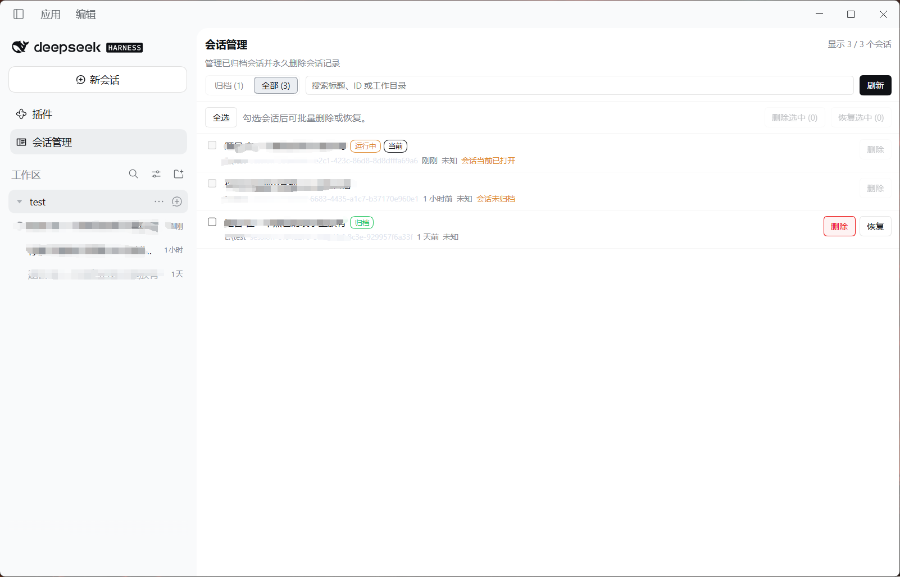

# dsh-session-manager · DSH 归档会话管理器

[](LICENSE)
[](package.json)
[](https://github.com/deepseek-ai/dsh)
[](test)
[](package.json)

在 DeepSeek Harness (DSH) 的 Web UI 里管理**归档会话**，并且可以像 Codex 那样**永久删除**会话——
不只是取消归档，而是把会话日志、投影缓存和工作区登记一起清掉。

[English](README.en.md) · [接口契约 SPEC.md](SPEC.md) · [问题反馈](https://github.com/qiaofugui/dsh-session-manager/issues)



*`会话管理` 面板：归档会话集中在一个列表里，带每条占用大小、搜索框、多选，以及需要确认弹窗的
不可撤销删除。删除会同时清掉会话日志、投影缓存与工作区登记，并写入审计日志。*

**特性**

- 浏览全部归档会话以及磁盘上的所有会话，显示每条的日志与缓存占用
- **永久删除**归档会话：会话日志、投影缓存、归档集合、置顶状态、工作区登记，一次清完
- 在面板里直接恢复（取消归档）或重新归档
- **归档**未归档的会话（释放之后这一步让删除变成可用）
- **释放**仍在内存里的会话：停掉正在运行的回合、从 Host 的 store 摘掉，日志仍留在磁盘上，之后就能删除
- 批量删除 / 批量恢复，弹窗列出全部 id 与总占用空间后才允许确认
- 默认安全：当前会话、运行中会话、存活会话一律拒绝，需显式开启；保护名单永远优先
- 审计日志记录每次删除、每个失败步骤与释放的字节数
- Host 侧零 npm 依赖、浏览器侧零客户端包引用，组合过程不可能因此失败
- 能力探测：每个可选的 Host 服务、插槽、路由与存储布局缺失时降级，而不是抛错

---

## 0. 快速安装

```
dsh plugin add https://github.com/qiaofugui/dsh-session-manager
```

或在 Web UI 里：侧栏 **插件** → **添加插件** → 粘贴同一个地址。
更多细节见 [§ 3 安装](#3-安装)。

---

## 1. 它能做什么

| 入口 | 位置 | 作用 |
| --- | --- | --- |
| **会话管理面板** | 侧栏图标（`会话管理`） | 归档 / 全部两个标签页、搜索、多选、批量删除、批量恢复、单行删除与恢复、显示磁盘占用 |
| **行内删除** | 会话行 `⋯` 菜单里的 `删除会话…` | 针对单个会话的快捷删除（当前会话与运行中的会话不出现该项） |
| **确认弹窗** | 全局覆盖层 | 显示数量、总空间、完整 id 列表，必须确认「此操作不可撤销」 |
| **诊断页** | 设置 → 会话管理 | 只读：已挂载的路由、根目录、计数、能力探测结果、审计日志路径 |

删除是不可撤销的，但**每一步都写审计**：

```
$DSH_HOME/session-manager/deleted.jsonl
```

---

## 2. 兼容性

这一节是重点。插件被设计成「**能力探测优先、缺失即降级**」：任何一个 Host 服务、插槽、路由面或
存储布局不存在时，插件都只会**变得不完整，而不是报错**；未挂载的插槽永远不会被写入，缺服务时
整个 Host 半边保持静默。

### 2.1 设计规则（都是硬约束，代码里有对应实现）

| 规则 | 原因 |
| --- | --- |
| Host 半边**只 `import` `node:*`**，不引用任何 `@deepseek-ai/*`、不引用 `zod` | 第三方 bundle 装进 profile 后解析不到这些包（`profiles/<name>/node_modules/@deepseek-ai` 是空目录） |
| 客户端 bundle 是**手写单文件**，只 `require('react')` | 没有打包链；`require('@deepseek-ai/dsh-client-ui-primitives')` 之类会抛错并让整个插槽变空白 |
| `Config` 是**手写 Standard Schema v1**，未知键**忽略** | 框架只读 `Config['~standard'].validate()`；新版本 `cordis.patch.yml` 里的新配置项不会让旧插件加载失败 |
| 所有可选服务都用 `ctx.inject([...], cb)` 或 `svc?.method?.()` 探测 | 缺失服务只会让回调不执行，不会抛异常导致整行变 `failed` |
| 不注入任何 Harness 客户端包（`dsh.client.external` 为空） | 只声明 `inject` 顺序，不制造模块图边；缺失提供方不会让组合失败 |
| 主题只用已验证存在的 `--dsw-alias-*` 变量，并带字面量兜底 | 变量改名只会让观感退化，不会让渲染崩掉 |
| 不写 `document.body`、不读别人的 DOM、不注入全局样式表 | 插件与宿主 UI 共处一个应用，不越界 |

### 2.2 Host 服务能力矩阵

每个服务都是可选的，缺省时的行为如下：

| 服务 | 存在时 | 缺失时 |
| --- | --- | --- |
| `connection`（`fetch.register`） | 挂载**已鉴权**路由 `/api/session-manager`，复用 `/api` 前缀里的 Host/Origin 校验 + 浏览器 Cookie | 跳过，仅用下面那条回落路由 |
| `webServer`（`register`） | 挂载**回落**路由前缀 `/session-manager/api`（自带回环 + Origin 校验） | 该路由不存在；前端会先试已鉴权路由 |
| `workspaceRegistry` | 归档集合读改、`detachSession` 清工作区登记、`archive/unarchive` | 删除仍会清日志与缓存；`restore/archive` 返回 `503 workspace-registry-unavailable`；`archivedIds` 为空 |
| `sessionPersistence` | 用它的 `.root` 作为日志根 | 回落到 `$DSH_HOME/sessions` |
| `sessions` / `agents` | 精确判断「已打开」与「正在运行」 | `liveDetection: false`，此时**只靠归档集合与保护名单**做拦截（见 §7 安全） |
| `dshHomePath` | 取 DSH 主目录 | 回落到 `%DSH_HOME%`，再回落到 `~/.dsh` |
| `ctx.locale`（前端） | 使用宿主语言字典 | 回落到 `client.js` 内置的 zh / en 字典 |
| `useSessions` / `useWorkspaces`（前端 props） | 与磁盘视图合并 | 只显示 Host `list` 返回的磁盘行 |
| `ctx.remote` / `ctx.on`（前端） | 监听 `api-session/removed` 自动刷新 | 删除成功后自己重新拉取列表 |

两条路由是**同时**注册、互不冲突的：已鉴权路由是精确路径，回落路由是另一个前缀路径。前端按
`api/session-manager` → `session-manager/api` 的顺序探测并缓存命中的那一个；HTTP 404/405 视为
「试下一个」，其余错误直接显示在面板上，所以路由层面的不兼容在 UI 里就能看见，而不是白屏。

### 2.3 会话存储格式兼容

删除逻辑**不解析会话日志**（不需要 zstd 解压，因此没有二进制依赖），而是按目录/文件形状定位：

- 任何项目目录名都接受：`--<projectKey>--`、`_no-cwd`、以及任何其它名字；
- 会话目录名按 DSH 的 `encodeSegment` 规则解码后与请求的 id 比较，因此 `session-…` 与
  **裸 UUID**（子会话）都能识别；
- 日志文件名**不做假设**：`session.v0..v4.jsonl`、`.jsonl.zst`、`.jsonl.zstd`、`session.jsonl`
  等任意代数都行——删除时删掉**整个会话目录**，所以新版本号自动兼容；
- 同时支持根目录下的**扁平布局**（会话目录直接位于 `sessions/` 下，或旧的
  `<projectKey>/<encodedId>.jsonl*` 文件）；
- 旧版**单文件投影缓存** `<storages>/session_projcache.json`（一个文件装所有会话）**永不删除**，
  只报告布局为 `single-legacy`；新版 per-record 布局 `<storages>/session_projcache/sessions/<id>.json`
  才删除，且同时尝试原 id 与编码后的文件名两种 stem；
- 删除前对每个路径都做**根目录包含性复验**（`assertInside`），符号链接不会把删除带出根目录。

### 2.4 平台兼容

- Windows：目录删除用 `fs.rm(..., { recursive, maxRetries: 5, retryDelay: 120 })`，避免杀软/句柄
  占用导致的 `EBUSY/EPERM`；空项目目录用 `fs.rmdir`（原子 `ENOTEMPTY`）而不是递归删除，杜绝
  检查与删除之间目录被重新填充导致的误删。
- POSIX：同上逻辑，`session.lock` 等残留文件随目录一起消失。
- Node：只用 `node:fs`、`node:path`、`node:os` 等稳定 API；`engines.node >= 18`。

### 2.5 版本声明

`package.json` 里声明了 `dshTarget: "0.2.0-rc.2"`（本机 DSH 版本），这是给插件市场/管理页的
兼容性提示字段，运行时不强制校验。真正的兼容性由上面的能力探测保证。

### 2.6 与其它插件共存

- **只通过 `workspaceRegistry` 服务改工作区状态**，不直接改 `storages/workspace.json`，因此不与
  宿主的工作区写入队列冲突。
- **不动附件**（`attachments` 是内容寻址、跨会话共享的，删会话不该删图片）。
- **不动别的插件自己的索引**（`dsh-usage`、`task-board`、`redteam`、`skin-center` 等）。如果确实要
  一起清，用 `cascadeRoots` 显式列目录，见 §5。
- 如果部署启用了**持久化的会话搜索索引**（SQLite 路径），删日志后索引里会留一条陈旧行；下次
  重建索引时消失。本插件不直接改别的插件的数据库。

---

## 3. 安装

### 在插件页填 GitHub 地址（推荐）

在 DSH 侧栏打开 **插件** 页 → **添加插件**，输入：

```
https://github.com/qiaofugui/dsh-session-manager
```

「添加插件」接受包名、**Git 地址**、压缩包或本地绝对路径，所以直接贴仓库地址即可。
装完点 **立即启用**，然后刷新浏览器页面，侧栏就会出现 `会话管理` 图标。

> 装完**不支持自动更新**：升级要先卸载再装新版。
> 不带 bundle patch 的包会在安装前被拒绝；本仓库有 `cordis.patch.yml`，可以直接过。

### 命令行

```
dsh plugin add https://github.com/qiaofugui/dsh-session-manager
```

或者指定某个 tag / commit（不加 `#` 时默认 `main`）：

```
dsh plugin add https://github.com/qiaofugui/dsh-session-manager#v1.0.0
```

### Agent 调用

在 DSH 会话里让 agent 调用 `plugin_manager`：

```
action: install_bundle
target: https://github.com/qiaofugui/dsh-session-manager
```

### 本地开发安装

源码在本地目录时，用绝对路径装（不需要 GitHub 网络）：

```
action: install_bundle
target: E:\test\dsh-session-manager
```

或等价地跑仓库自带脚本（幂等，会自动备份 profile 的 `package.json`）：

```powershell
& "$env:DSH_HOME\dsh-runtimes\dsh-primary-runtime\dependencies\node\bin\node.exe" `
  E:\test\dsh-session-manager\tools\install-profile.mjs
# 只预览，不写入
& "...node.exe" "...\tools\install-profile.mjs" --dry-run
# 撤销 bundle 登记并删除复制目录
& "...node.exe" "...\tools\install-profile.mjs" --uninstall
```

### 卸载

在**插件**页里对该组合包点卸载（会要求确认）；或 Agent 调用 `remove_bundle`，`target` 填
`dsh-session-manager`。插件不残留全局状态；审计日志在 `$DSH_HOME\session-manager\`，按需删除。

### 装完怎么确认

```powershell
Invoke-RestMethod "http://127.0.0.1:19387/session-manager/api?op=status"
```

返回 `ok: true` 就说明 Host 半边已挂载。

> 该路由是回环专用的诊断入口：只接受本机连接、要求 `Origin` 与 `Host` 同源，且 `POST` 必须带
> `x-dsh-session-manager: 1` 头和 `application/json`。不带浏览器 Cookie 访问 `/api/session-manager`
> 会得到 `401`，这是正常的——浏览器里的面板会自动带上 Cookie。

---

## 4. 使用

1. 侧栏点 `会话管理` 图标。
2. `归档` 标签页只列归档会话（默认）；`全部` 标签页列磁盘上所有会话（含正在运行的，但它们的
   删除按钮是禁用的）。
3. 用搜索框按 id / 项目目录 / 路径过滤。
4. 勾选若干行 → 底部批量条 → `删除选中 (n)`。
5. 确认弹窗里核对数量、总空间与完整 id；多选时必须勾选「我已确认」才能点删除。
6. 删除完成后会重新拉取列表，并显示释放的空间。

也可以在会话行的 `⋯` 菜单里直接点 `删除会话…`。当前会话与正在运行的会话**不会**出现在该菜单里
（前端直接不发请求）。

---

## 5. 删除语义：删了什么、没删什么

**删除的（按顺序执行）**

1. 会话目录 `$DSH_HOME/sessions/<project>/<encodedId>/`（整目录，涵盖所有代数的日志与锁文件）；
   若配置为扁平布局，则删除对应的 `*.jsonl*` 文件；
2. 投影缓存记录 `$DSH_HOME/storages/session_projcache/sessions/<id>.json`（per-record 布局；
   单文件旧布局不删）；
3. `cascadeRoots` 里显式列出的目录中按会话 id 命名的文件/目录；
4. 归档集合：`workspaceRegistry.unarchiveSession(id)`；置顶集合：`unpinSession(id)`；
5. 工作区登记：每个包含该 id 的工作区执行 `detachSession(id)`；
6. 向浏览器发 `api-session/removed`，让会话列表立即少一行；
7. 追加一条审计记录（JSONL）：时间、id、项目、目录、释放字节、每步结果、失败原因、调用方。

**不删的**

- 共享附件（内容寻址、跨会话复用）；
- 别的插件自己的索引/数据库；
- 旧版单文件投影缓存；
- 任何不在上述根目录内的路径（包含性复验失败即拒绝）。

**顺序与可重试性**：先删文件（不可逆），再做登记（可逆）。如果文件删除失败，登记完全没动，
可以原样重试；如果文件删掉了但登记失败，结果会标 `error: "partial"` 并**不算成功**，下次重试会
只做「残留清理」（`action: cleanup-residue`），把归档集合与工作区登记补完。

### 级联清理（`cascadeRoots`）

默认是空的，因为别的插件的数据属于它们自己。若你确认要一起清，例如：

```yaml
cascadeRoots:
  - "C:\\Users\\Joe__\\.dsh\\task-board"
```

每个根目录下只会检查这四种形状：`<root>/<id>.json`、`<root>/<id>`、
`<root>/sessions/<id>.json`、`<root>/sessions/<id>`（id 同时尝试原样与 `encodeSegment` 编码形式）。

---

## 6. 配置

配置写在 profile 的 `cordis.patch.yml` 里（覆盖同一个 `id` 会**整体替换** `config`，所以要写全
你想保留的键）：

```yaml
- id: dsh-session-manager
  name: dsh-session-manager
  config:
    allowDeleteUnarchived: false
    maxBatch: 200
```

| 键 | 默认 | 说明 |
| --- | --- | --- |
| `enabled` | `true` | 总开关；`false` 时该行不注册任何东西 |
| `allowDeleteArchived` | `true` | `false` 时归档会话被视为受保护（原因码 `protected`） |
| `allowDeleteUnarchived` | `false` | 是否允许删除**未归档**的会话（面板「全部」标签页需要它） |
| `allowDeleteLive` | `false` | 是否允许删除仍然存活（已打开/可挂起）的会话 |
| `releaseLive` | `true` | 删存活会话前**先释放内存里的会话对象**：停掉正在运行的回合（`workspace/session-stop`），再从 `SessionStore` 摘除。同时控制着「释放」按钮是否出现。关掉它会留下孤儿对象，日志目录有可能被重新写出来 |
| `purgeProjectionCache` | `true` | 删除投影缓存记录（缓存可由日志重建，删除总是安全的） |
| `pruneEmptyProjects` | `true` | 项目目录下最后一个会话被删后，删除空的 `--<project>--` 目录 |
| `cascadeRoots` | `[]` | 额外按会话 id 清理的根目录，见 §5 |
| `protectedSessionIds` | `[]` | 永不删除的会话 id 名单 |
| `maxBatch` | `200` | 单次请求最多删多少个；超出的 id 会以 `over-batch` 跳过 |
| `dryRun` | `false` | 只报告计划，不动磁盘（前端「预览」按钮也会传 `dryRun`） |
| `auditLog` | `''` | 审计日志路径；空 = `$DSH_HOME/session-manager/deleted.jsonl` |
| `routePath` | `''` | 空 = `/api/session-manager` |
| `fallbackRoutePath` | `''` | 空 = `/session-manager/api` |
| `managerDir` | `''` | 空 = `$DSH_HOME/session-manager`（放审计日志） |

布尔值接受 `true/false`、`"true"/"false"/"1"/"0"`；`""` 一律按 `true`（避免把 `dryRun: ""` 误判成
关闭）。**未知键会被忽略并丢弃**，以便旧版插件读新配置时不报错。

配置校验失败时插件**不会**让整行变 `failed`：会退回默认值并写一条 warning 日志。

---

## 7. 安全设计

- **默认只删归档会话**。归档本身就是「我暂时不想看到它」，删除是它的自然延伸。
- **当前会话**：`decide` 的最高优先级拦截（`current`）。插件自身会话（`DSH_SESSION_ID`）也被保护。
- **存活/运行中会话**：默认拒绝（`live` / `running`），需要显式 `allowDeleteLive`。
- **保护名单**：`protectedSessionIds`，永远优先。
- **路径安全**：请求的 id 必须是单个路径段；解码后为 `.`/`..`/含分隔符的一律以 `invalid-id` 拒绝；
  每个待删路径在删除前都要通过「严格位于允许根目录内」的复验。
- **CSRF**：已鉴权路由靠 Cookie + Host/Origin 校验；回落路由额外要求循环回环地址、
  `sec-fetch-site != cross-site`、`Origin` 与 `Host` 同源、`content-type: application/json`，
  以及自定义头 `x-dsh-session-manager: 1`（表单无法伪造自定义头），并对 `OPTIONS` 一律不返回 CORS
  头。请求体上限 512 KiB。
- **写操作必须 POST**：`delete`/`release`/`restore`/`archive` 走 GET 一律 `405 use-post`。
- **审计**：每次删除、每次释放和每次残留清理都会追加一行 JSONL，失败步骤也记录在案。

---

## 7a. 释放仍在内存里的会话

### 按钮：先释放，再删除

还在内存里的会话（`live` / `running`）默认删不掉。与其让用户卡在这里，面板在每一个「仍在内存中
且不是当前会话」的行上给出 **释放** 按钮：

1. 行上出现 `释放`（删除按钮仍是禁用的）。底部批量栏的 `释放选中 (n)` 对所选行做同样的事，
   只统计真正可释放的行。
2. 释放会停掉正在运行的回合，并把会话从 Host 的内存 store 里摘掉。**磁盘上什么都没动**——
   日志和投影缓存原样留在原地。
3. 面板重新拉取列表：这一行失去 `live`/`running` 徽标。**释放不会自动归档**——如果这个会话
   本来没归档，删除按钮仍是禁用的，提示会明确告诉你下一步；点同一行的 `归档`（或开启
   `allowDeleteUnarchived`）之后删除即可用。

所以「这个运行中的会话必须干掉」的完整流程是 **释放 → 归档 → 删除**，不需要改任何配置。
当前会话永远不提供释放——那会把你正看着的界面所绑定的 Host 对象拆掉。

### Host 实际做了什么

1. **停止活动**。`workspaceRegistry.stopSessionActivity(id)`——就是 DSH 自己归档准入用的那条接缝。
   Agent 注册表按用户自己的方式取消当前回合（`agent.cancel({ kind: 'user' })`），任务注册表逐个
   kill 该会话的任务。这一步是 await 的，所以回合的收尾事件会先落盘。没有这条接缝时回落到
   `ctx.parallel('workspace/session-stop', { sessionId })`，再回落到 `ctx.emit`。
2. **从 store 摘除**。`sessions.liveEntryFor(session).detach()`——`SessionStore` 公开的释放入口：
   把条目从 store 里删掉，并发出一条配对的 `session/disposed`。创建它的 fiber 之后再来调用自己的
   disposer 会变成空操作，所以重复释放是安全的。
3. **校验**。此时 `sessions.get(id)` 必须是 `undefined`。如果 detach 之后仍在 store 里，这次操作
   报失败，而不是留下一个能把日志写回来的孤儿。

开了 `allowDeleteLive` 时，`delete` 内部会自动跑同样这三步——所以删除一个存活会话不可能留下一个
还在往「已删除目录」里追加事件的旧对象。每一步都单独兜错，所以缺 `sessions` 服务、或没有任何 stop
监听时，会降级成显式失败（`failed.stop` / `failed.release`），而不是抛异常。把 `releaseLive` 设成
`false` 会同时关掉自动释放和这个手动按钮，结果里带
`live session left in the in-memory store (releaseLive is off)` 这条警告。

残留清理阶段同样会跑一次释放，所以部分失败后的重试也会把内存对象一并收掉。

---

## 8. 已知限制

- 不清理别的插件的会话索引（见 §2.6）。
- 旧版单文件投影缓存布局不清理（安全第一）。
- 面板的「全部」标签页在 `allowDeleteUnarchived: false` 时所有非归档行都不可删除——这是刻意的。
- 没有内置的「回收站」；删除不可撤销，只有审计日志留痕。
- `releaseLive` 依赖 `SessionStore` 暴露 `liveEntryFor()`；DSH 改掉该 API 时，删除会以
  `failed.release` 失败而不是静默留下孤儿会话。

---

## 9. 开发与测试

```
dsh-session-manager/
├─ index.js            # Host 入口（Cordis apply）
├─ client.js           # 浏览器 bundle（手写，window.__ModuleLoader__）
├─ cordis.patch.yml    # bundle patch，插入插件行
├─ lib/
│  ├─ config.js        # 手写 Standard Schema + 默认值
│  ├─ encoder.js       # DSH 路径段编解码、id 校验
│  ├─ scanner.js       # 唯一触碰文件系统的模块：扫描 / 删字节 / 包含性复验
│  ├─ plan.js          # 纯策略：原因码与优先级
│  ├─ delete.js        # 删除流水线：先释放内存中的会话，再文件 → 登记 → 事件 → 审计
│  ├─ audit.js         # JSONL 审计
│  ├─ ops.js           # 唯一的操作分发器（status/list/delete/release/restore/archive）
│  └─ routes.js        # 两条 HTTP 适配器 + 回落路由的围栏
├─ locale/             # 客户端字典（zh/en），client.js 内还有一份内置副本
├─ tools/
│  ├─ install-profile.mjs  # 幂等安装/卸载进 profile
│  └─ probe-live.mjs       # 只读探测真实 $DSH_HOME，预览删除计划
└─ test/
   ├─ host-core.test.mjs   # 29 项
   ├─ client.test.mjs      # 浏览器 bundle 的注册、降级、字典与释放链路
   ├─ integration.test.mjs # 44 项：假 ctx + 合成 DSH home + 真实请求/响应
   └─ run.mjs              # 一次跑全部
```

```powershell
# 全部测试（注意：node --test <多文件> 在受限沙箱里会 EPERM，用 --test-isolation=none 或直接跑单个文件）
& "$env:DSH_HOME\dsh-runtimes\dsh-primary-runtime\dependencies\node\bin\node.exe" `
  --test --test-isolation=none E:\test\dsh-session-manager\test\run.mjs

# 只读探测真实 $DSH_HOME，确认插件看得见你的会话（不写任何东西）
& "...node.exe" E:\test\dsh-session-manager\tools\probe-live.mjs
```

测试不会读写真实的 `$DSH_HOME`：每个用例都在 `%TEMP%` 下建自己的合成 DSH 主目录并在结束时清理。

**实测状态**（DSH `0.2.0-rc.2`，desktop profile，Windows）：已在真实环境安装并挂载，
`/session-manager/api?op=status` 返回 13 个会话 / 3 个归档 / 6.2 MiB；
不带 Cookie 访问 `/api/session-manager` 返回 401；跨站 `Origin` 的删除请求返回 403。

[SPEC.md](SPEC.md) 是冻结的接口契约（wire protocol、模块签名、插槽注册、兼容性约束），
改动行为前先改它。

## 10. 许可

[MIT](LICENSE)
